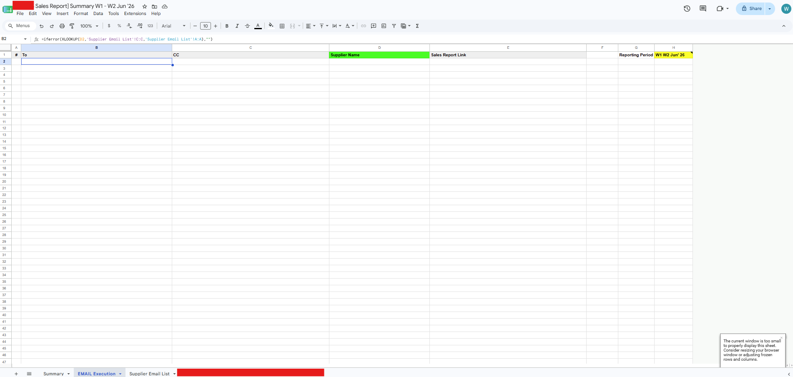
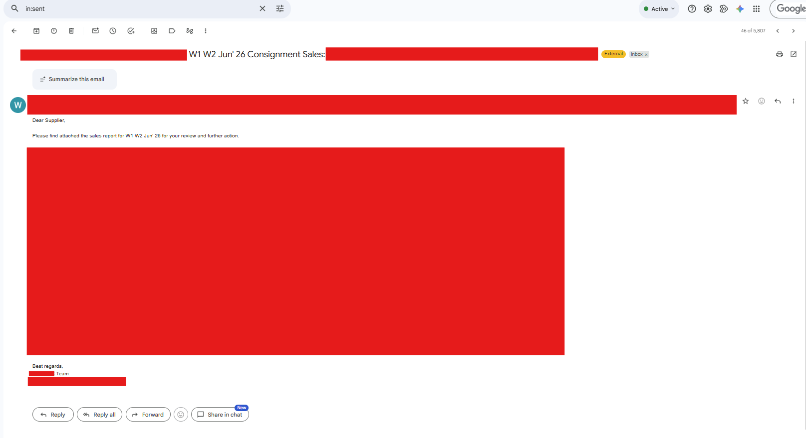
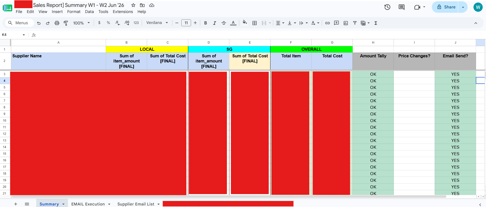

# Sales Report & Post-Report Tracking Automation (Google Apps Script)

A Google Apps Script automation solution that streamlines the supplier sales reporting process. The script generates personalized sales report emails, distributes report links to suppliers, and automatically updates a tracking sheet to monitor report delivery status.

---

## Features

- Automates supplier sales report distribution
- Generates dynamic email subjects and content
- Supports multiple CC recipients
- Inserts supplier-specific report links into emails
- Automatically updates report delivery status
- Reduces manual reporting and email preparation
- Maintains a centralized tracking sheet for report execution

---

## Workflow

1. Reads supplier information from the **EMAIL Execution** sheet.
2. Retrieves the reporting period from the spreadsheet.
3. Generates personalized email subjects and content.
4. Sends sales report emails to suppliers with CC recipients.
5. Includes a direct link to each supplier's sales report.
6. Updates the **Summary** sheet by marking successfully sent reports as **YES**.

---

## Setup

1. Open Google Sheets → **Extensions** → **Apps Script**
2. Paste the script into `Code.gs`
3. Ensure the following sheets exist:
   - `EMAIL Execution`
   - `Summary`
4. Populate the **EMAIL Execution** sheet with supplier details.
5. Enter the reporting period in cell `H1`.
6. Run `sendEmails()`.

---

## Email Execution Structure

The EMAIL Execution sheet contains supplier email information and report links. Screenshot below shows a sample structure for reference.

| Email | CC Email | Supplier Name | Sales Report Link |
|-------|----------|---------------|-------------------|
| supplier@email.com | cc@email.com | Supplier A | https://... |

---

## Summary Sheet

After each successful email, the corresponding supplier is automatically marked as **YES** in the **Summary** sheet to indicate that the sales report has been sent.

---

## Notes

- Supplier names are matched against the **Summary** sheet.
- Email subject includes the reporting period and supplier name.
- Supports multiple CC recipients.
- Sales report links are dynamically inserted into each email.
- Successfully processed suppliers are highlighted automatically in the tracking sheet.

---

## Screenshots

### EMAIL Execution Sheet

### Email Generation

### Summary Tracking

